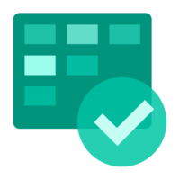
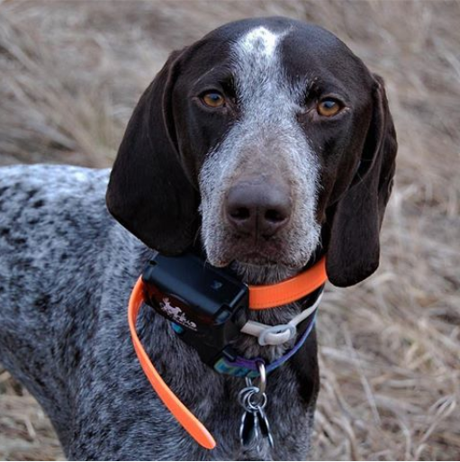

### ⚒ Currently working at ...

<table>
  <tr>
      <td>
        
      </td>
    <td>
        
      </td>
    <td>
        
      </td>
  </tr>
</table>

### 👯 My most active work related projects are

- [Sync GitHub issue to Azure DevOps work item](https://github.com/danhellem/github-actions-issue-to-work-item)
- [Sync GitHub Pull Requests to Azure DevOps](https://github.com/danhellem/github-actions-pr-to-work-item)
- [Azure DevOps Process CLI](https://github.com/danhellem/azure-devops-process-cli)

### 🌱 My most active personal projects are

- [uplandreviews.com](https://github.com/uplandprojects/uplandreviews.com)
- Several other private repos 😉

### 🔭You can find me at

- [LinkedIn](https://www.linkedin.com/in/danhellem/)
- [Instagram](https://www.instagram.com/danhellem/)

### 🐶 My buddy pictures

<table border="0" style="border-style: none">
  <tr>
    <td>
      
    </td>
  </tr>
</table
